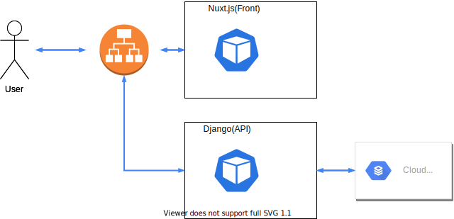
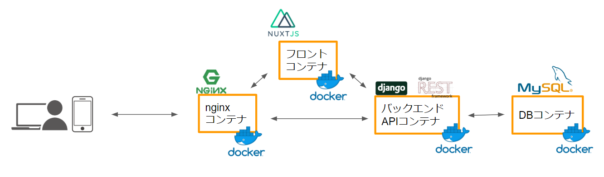

# k8s-base

Learning about Kubernetes!

## Description

yoshikawa/k8s-base − learning about Kubernetes

### Deploy image



### requirements

|Lang/FrameWork|Version|
|:--|--:|
|Python|3.8.5|
|Django|3.1|
|Node.js|14.7.0|
|NPM|6.14.7|
|Nuxt.js|2.14.1|
|Docker|19.03.12|

## How to set up a local development environment

### Local development environment image



### Getting Started

#### Prerequisites

You need to use the software and install them.

```sh
brew cask install docker
# If you haven't started Docker, you have to run the following command:
open /Application/Docker.app
```

#### Installation

1. Clone the repo

```sh
git clone git@github.com:tekonfo/ei4sittyo.git
```

2. Start the server as described below.

### Backend Server

```sh
make
```

access: `localhost:8000`

### Frontend Server

```sh
make client
```

access: `localhost:3000`

## Contribution

1. [Fork it](https://github.com/tekonfo/ei4sittyo/fork)
2. Create your feature branch
3. Commit your changes
4. Push to the branch
5. reate new Pull Request

## Licence

[WTFPL](https://github.com/yoshikawa/k8s-base/blob/master/LICENSE)


## Author

[Yoshikawa Taiki](https://github.com/yoshikawa)
