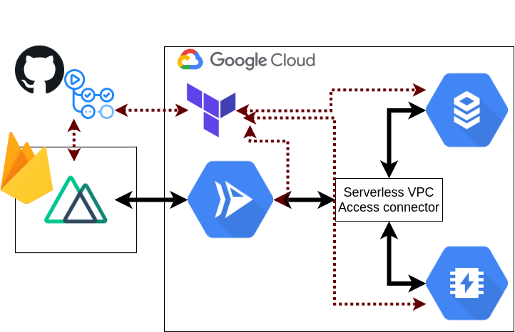

# Deploy it with Terraform

### デプロイ先の構成要素



### Contributors

[Yoshikawa Taiki](https://github.com/yoshikawa)

### Docker Image を gcr にアップロード

```sh
cd ../django # DjangoのDockerfileをビルドしたいので
vim .env     # .env でsendgridのアカウント、パスワードを指定してください
gcloud builds submit --timeout=1800s --tag gcr.io/a4shittyo-app/django
```

### GCP の初期設定

**`CREDENTIALS_FILE.json` を `terraform` ディレクトリに用意すれば、初期設定はいりません**

```sh
# terraformディレクトリで実行してください
export PROJECT_ID=a4shittyo-app
export ACCOUNT_ID=$(gcloud beta billing accounts list | grep True | cut -d ' ' -f1)
gcloud auth login
gcloud projects create $PROJECT_ID
gcloud config set compute/region asia-northeast1
gcloud config set project $PROJECT_ID
gcloud beta billing projects link $PROJECT_ID --billing-account=$ACCOUNT_ID

# enable apis
gcloud services enable \
    cloudapis.googleapis.com \
    cloudresourcemanager.googleapis.com \
    container.googleapis.com \
    containerregistry.googleapis.com \
    iam.googleapis.com \
    redis.googleapis.com \
    servicenetworking.googleapis.com \
    sqladmin.googleapis.com \
    run.googleapis.com \
    vpcaccess.googleapis.com

# Create a service account for terraform
gcloud iam service-accounts create terraform \
    --description="Terraform Service Account" \
    --display-name="Terraform"

gcloud projects add-iam-policy-binding $PROJECT_ID \
  --member serviceAccount:terraform@$PROJECT_ID.iam.gserviceaccount.com \
  --role roles/owner

gcloud iam service-accounts keys create CREDENTIALS_FILE.json --iam-account=terraform@$PROJECT_ID.iam.gserviceaccount.com --project $PROJECT_ID
```

**Google API が足りないというエラーが出たら、URL 先から API を有効化してください**

```sh
terraform init
terraform plan
terraform apply
```

### References

[Build it with Terraform](https://hackersandslackers.com/terraform-with-google-cloud/)
[Cloud Run から Cloud SQL や Memorystore への繋ぎ方](https://allabout-tech.hatenablog.com/entry/2020/06/30/133859)
